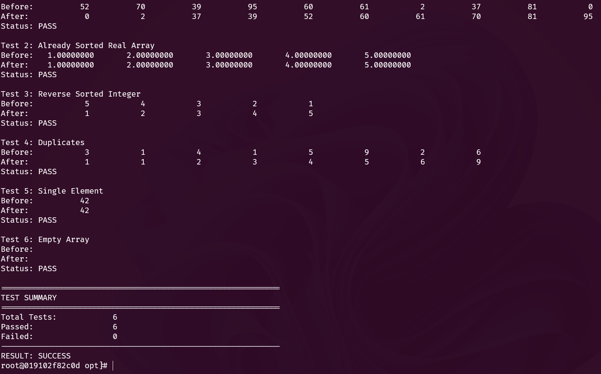

# Fortran Quicksort Module

## Overview

This project implements a robust, iterative Quicksort algorithm in Fortran, designed to meet strict systems programming requirements. It features a generic interface for sorting both integer and real arrays without using recursion or internal dynamic memory allocation.

---

## Project Structure

The repository is organized as follows:

* **`src/sorting_module.f90`** — The core library containing the `PURE` Quicksort implementation and generic interface.
* **`test/run_tests.f90`** — The test suite that validates the sorting logic against various edge cases.
* **`gfortran.docker`** — The Docker configuration file provided to replicate the required GNU Fortran 15 environment.
* **`fpm.toml`** — The configuration file for the Fortran Package Manager (FPM), allowing for automated building and testing.
* **`.gitignore`** — Configuration file to prevent build artifacts (like `.o`, `.mod`, executables) from being tracked by git.
* **`README.md`** — This documentation file.

---

## Prerequisites

* **Docker** — Required to build the standardized compilation environment.

---

## 1. Environment Setup

Before running the code, you must build the Docker container. This ensures you are using the exact compiler version required by the challenge.

Run this command from the project root:
```bash
docker build -t arch-gfortran -f gfortran.docker .
```

---

## 2. Compilation and Execution

You can compile and run the project using one of the two methods below. First, enter the Docker environment:

**On Linux/macOS:**
```bash
docker run --rm -it -v "$(pwd):/opt" arch-gfortran
```

**On Windows (PowerShell):**
```powershell
docker run --rm -it -v "${PWD}:/opt" arch-gfortran
```

### Method A: Using FPM (Recommended)

The Fortran Package Manager (`fpm`) is pre-installed in the Docker container and handles compilation, linking, and testing automatically.

**Run the full test suite:**
```bash
fpm test
```

### Method B: Manual GFortran Compilation

If you need to verify the code using standard compiler commands without FPM, follow this sequence inside the container:

1. **Compile the Module:**
```bash
   gfortran -c src/sorting_module.f90 -J. -o sorting_module.o
```

2. **Compile the Test Program:**
```bash
   gfortran -c test/run_tests.f90 -I. -o run_tests.o
```

3. **Link the Executable:**
```bash
   gfortran sorting_module.o run_tests.o -o run_tests
```

4. **Run the Tests:**
```bash
   ./run_tests
```

---

## Test Scenarios

The `run_tests.f90` suite automatically verifies the correctness of the algorithm using the following cases:

* Random Integer Array (N=10)
* Already Sorted Real Array
* Reverse Sorted Integer Array
* Array with Duplicates
* Single Element Array
* Empty Array

Visual verification (Before/After printouts) is provided for each test case in the output.

---

## Sample Test Output

You can reference the picture below to see the expected test output:



---

## License

This project is released under the MIT License (or specify your license here).

## Contributing

Contributions are welcome! Please open an issue or submit a pull request for any improvements or bug fixes.